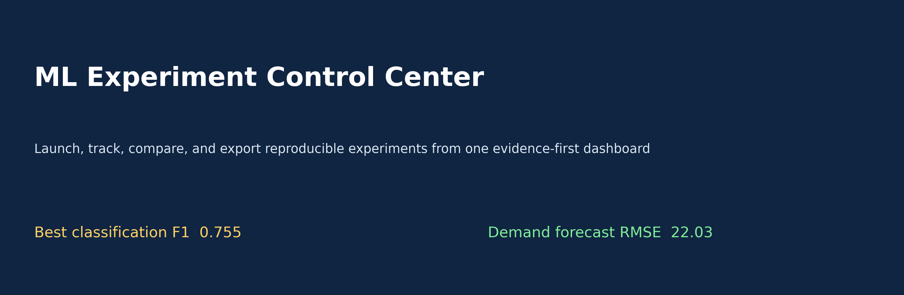
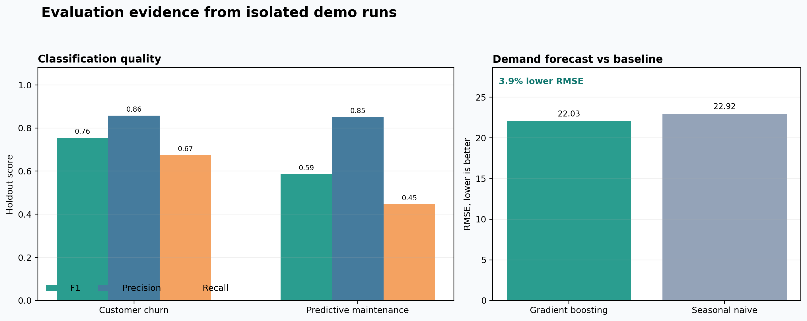
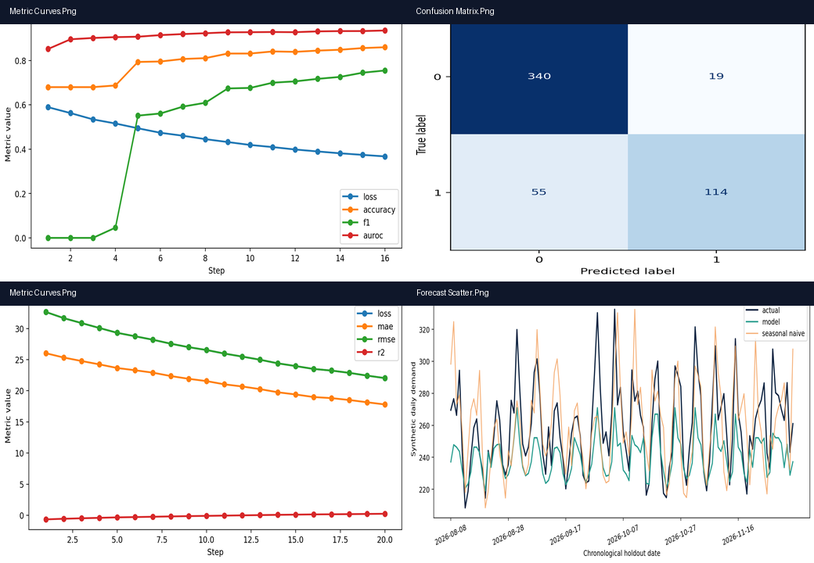
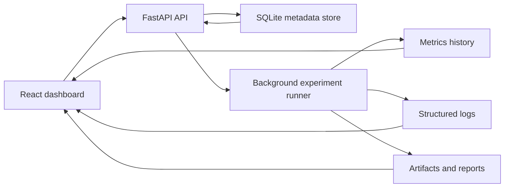

# ML Experiment Control Center




This project is a lightweight internal ML platform built for launching experiments, tracking run metadata, streaming logs, comparing results, browsing artifacts, and exporting run summaries. It is designed to feel closer to real product engineering than a notebook-only machine learning project.

## Why this project is strong

- It combines backend APIs, frontend product design, persistence, reproducibility, artifact handling, and testing.
- It treats ML runs like first-class software objects with run IDs, config versioning, structured logs, seeds, and summary pages.
- It supports multiple built-in workloads so the platform feels like a real internal tool instead of a one-off dashboard.

## What the app does

- Launch experiments from a preset or uploaded JSON config
- Persist run metadata and metric histories in SQLite
- Stream structured logs live through server-sent events
- Compare experiments side-by-side
- Visualize loss, accuracy, F1, AUROC, MAE, RMSE, and R2
- Browse artifacts such as confusion matrices, metric plots, predictions, configs, and model cards
- Export HTML run summaries

## Demo outputs

### Demo run comparison


### Artifact gallery


## Built-in workloads

| Workload | Task type | Purpose |
| --- | --- | --- |
| Customer Churn Baseline | Classification | Business-friendly retention modeling workload |
| Predictive Maintenance Classifier | Classification | Sensor-style failure risk tracking |
| Demand Forecasting Regressor | Regression | Forecasting-style workload with seasonality and pricing effects |

## Demo scorecard snapshot

| Run | Status | Key metrics |
| --- | --- | --- |
| Customer Churn Baseline | Completed | Accuracy `0.860`, F1 `0.755`, AUROC `0.935` |
| Predictive Maintenance Classifier | Completed | Accuracy `0.844`, F1 `0.586`, AUROC `0.914` |
| Demand Forecasting Regressor | Completed | RMSE `82.542`, MAE `64.690`, R2 `0.610` |

## Architecture



## Engineering details included

- Config versioning and seed tracking
- Unique run IDs and git commit hash capture
- Structured JSONL logging
- Pagination and filtering on run lists
- Side-by-side experiment comparison
- REST API docs via FastAPI OpenAPI
- Artifact browser and exportable HTML reports
- Unit tests for run registration and API behavior
- Frontend test coverage for experiment table interaction
- Docker-based local startup

## Project structure

| Path | Purpose |
| --- | --- |
| `backend/app/` | FastAPI app, database models, API routes, and run orchestration |
| `backend/tests/` | Backend API tests with `pytest` |
| `frontend/src/` | React dashboard, charts, log stream, filters, and artifact browser |
| `storage/runs/` | Generated artifacts and logs for each run |
| `scripts/seed_demo_runs.py` | Generates demo runs for screenshots and local exploration |
| `scripts/generate_readme_graphics.py` | Builds the README visuals from actual run output |
| `docker-compose.yml` | Full local stack startup |

## Local setup

### 1. Backend

```powershell
py -3.13 -m venv .venv
.venv\Scripts\python.exe -m pip install -r backend\requirements.txt
.venv\Scripts\python.exe -m uvicorn app.main:app --reload --app-dir backend
```

Backend docs will be available at [http://127.0.0.1:8000/docs](http://127.0.0.1:8000/docs).

### 2. Frontend

```powershell
cd frontend
npm install
Copy-Item .env.example .env
npm run dev
```

Frontend will run at [http://127.0.0.1:5173](http://127.0.0.1:5173).

Use Node `20.19+` or `22.12+` to avoid Vite's engine warning.

### 3. Seed demo runs

```powershell
.venv\Scripts\python.exe scripts\seed_demo_runs.py
```

## Docker setup

```powershell
docker compose up --build
```

## API overview

| Endpoint | Purpose |
| --- | --- |
| `GET /api/v1/presets` | List built-in workloads and default configs |
| `POST /api/v1/runs` | Launch a new experiment |
| `GET /api/v1/runs` | Paginated run list with filters |
| `GET /api/v1/runs/{run_id}` | Run summary, config, and artifacts |
| `GET /api/v1/runs/{run_id}/metrics` | Metric history for charts |
| `GET /api/v1/runs/{run_id}/logs` | Live log stream via SSE |
| `GET /api/v1/runs/{run_id}/artifacts/{artifact_name}` | Download or inspect artifacts |
| `GET /api/v1/runs/{run_id}/report` | Exportable HTML summary |

## Testing

### Backend

```powershell
cd backend
..\.venv\Scripts\python.exe -m pytest
```

### Frontend

```powershell
cd frontend
npm test
npm run build
```

