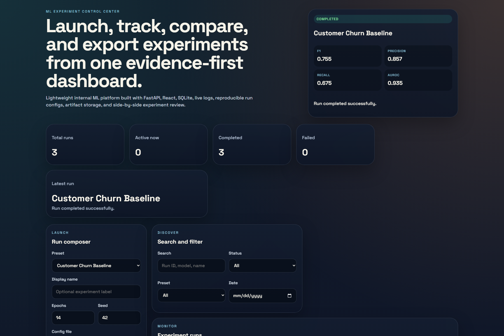
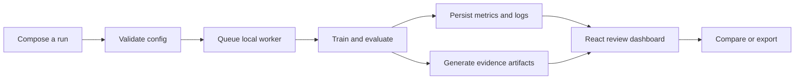
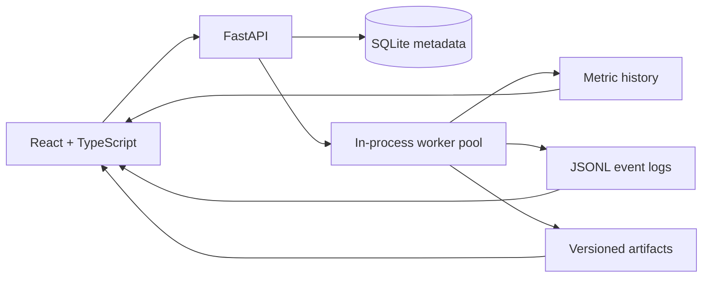

# ML Experiment Control Center



[](https://github.com/Ikteder/ml-experiment-control-center/actions/workflows/ci.yml)


An evidence-first local ML platform for launching experiments, tracking reproducibility metadata, streaming structured logs, comparing results, inspecting artifacts, and exporting reports. It demonstrates the product and engineering work around a model, not only the training code.

## Why it stands out

- End-to-end product: FastAPI, React, TypeScript, SQLite, background execution, live logs, and generated artifacts.
- Reproducible runs: immutable run IDs, seeds, config versions, source revisions, and saved configs.
- Evaluation discipline: stratified classification holdouts, chronological forecasting holdouts, leakage-safe lag features, and a seasonal-naive forecast baseline.
- Reviewable evidence: prediction files, metric histories, confusion matrices, forecast plots, dataset cards, model cards, and HTML reports.
- Safer engineering: isolated tests and demo data, strict config validation, startup recovery, constrained CORS, non-root containers, health checks, and CI.

## Evaluation evidence

The bundled workloads use deterministic synthetic fixtures so anyone can reproduce the application workflow without downloading private or licensed data. These numbers validate the pipeline, not real-world model readiness.


| Workload | Evaluation | Result |
| --- | --- | --- |
| Customer Churn Baseline | Seeded stratified holdout | F1 `0.755`, precision `0.857`, recall `0.675`, AUROC `0.935` |
| Predictive Maintenance Classifier | Seeded stratified holdout | F1 `0.586`, precision `0.851`, recall `0.447`, AUROC `0.914` |
| Demand Forecasting Regressor | Final chronological block | RMSE `22.03` vs seasonal-naive `22.92`, a `3.9%` improvement |

The predictive-maintenance result exposes a useful failure mode: high precision and low recall. The platform preserves both values and the confusion matrix instead of hiding that tradeoff behind accuracy.

## Generated artifacts


Every completed run records:

- `config.json` with the resolved reproducibility settings
- `metrics_history.csv` and `predictions.csv`
- Task-specific plots such as a confusion matrix or chronological forecast
- `dataset_card.md` covering source, construction, split, and limitations
- `model_card.md` covering intended use, evaluation, risks, and scorecard
- An exportable `report.html`

## Product workflow



## Built-in workloads

| Workload | Task | Evaluation design |
| --- | --- | --- |
| Customer Churn Baseline | Binary classification | Seeded, stratified random holdout |
| Predictive Maintenance Classifier | Binary classification | Seeded, stratified random holdout |
| Demand Forecasting Regressor | Daily regression | Chronological final-block holdout with lag-1, lag-7, shifted rolling mean, and seasonal-naive baseline |

## Architecture



## Run it locally

Prerequisites: Python 3.12 or 3.13 and Node 20.19+ or 22.12+.

### 1. Install the backend

```powershell
py -3.13 -m venv .venv
.venv\Scripts\python.exe -m pip install -r backend\requirements-dev.txt
```

### 2. Create isolated demo runs

```powershell
.venv\Scripts\python.exe scripts\seed_demo_runs.py
$env:MLECC_DATABASE_URL = "sqlite:///./.demo-runtime/app.db"
$env:MLECC_STORAGE_ROOT = ".demo-runtime/storage"
.venv\Scripts\python.exe -m uvicorn app.main:app --reload --app-dir backend
```

The seed command resets only `.demo-runtime/`. It never touches the normal application database or `storage/runs`.

API documentation: [http://127.0.0.1:8000/docs](http://127.0.0.1:8000/docs)

### 3. Start the frontend

```powershell
cd frontend
npm ci
Copy-Item .env.example .env
npm run dev
```

Dashboard: [http://127.0.0.1:5173](http://127.0.0.1:5173)

## Docker

```powershell
$env:MLECC_SOURCE_REVISION = git rev-parse --short HEAD
docker compose up --build
```

The stack includes backend and frontend health checks. The backend container runs as a non-root user and records the supplied source revision on new runs.

## API

| Endpoint | Purpose |
| --- | --- |
| `GET /api/v1/presets` | List built-in workloads and default configs |
| `POST /api/v1/runs` | Validate and launch an experiment |
| `GET /api/v1/runs` | Paginated, searchable, filterable run list |
| `GET /api/v1/runs/{run_id}` | Run metadata, scorecard, config, and artifacts |
| `GET /api/v1/runs/{run_id}/metrics` | Metric history for charts |
| `GET /api/v1/runs/{run_id}/logs` | Structured logs through server-sent events |
| `GET /api/v1/runs/{run_id}/artifacts/{artifact_name}` | Inspect or download an artifact |
| `GET /api/v1/runs/{run_id}/report` | Export an HTML run summary |

## Verification

```powershell
cd backend
..\.venv\Scripts\python.exe -m pytest -q

cd ..\frontend
npm run lint
npm test -- --run
npm run build
```

CI runs the backend suite on Python 3.12 and 3.13, and the frontend checks on Node 20 and 22.

## Repository map

| Path | Purpose |
| --- | --- |
| `backend/app/` | API, persistence, schemas, presets, and run orchestration |
| `backend/tests/` | Isolated API and forecasting tests |
| `frontend/src/` | Dashboard, charts, launch controls, filters, logs, and artifacts |
| `docs/datasets/` | Dataset provenance and limitations |
| `docs/experiments/` | Verification records and measured results |
| `docs/models/` | Evaluation summary and intended-use notes |
| `docs/decisions/` | Engineering and modeling tradeoffs |
| `scripts/` | Safe demo seeding and evidence-graphic generation |

## Honest limitations

- All bundled datasets are synthetic software fixtures. No result should be interpreted as production model performance.
- The worker pool is intentionally local and in-process. It is not a distributed queue and does not resume partially trained models after a crash.
- SQLite and local files suit a portfolio demo or single-user tool, not a multi-tenant production deployment.
- There is no authentication, role-based access control, remote object store, or hosted deployment in this version.

See the [dataset documentation](docs/datasets/synthetic-workloads.md), [model evaluation summary](docs/models/evaluation-summary.md), and [technical decision record](docs/decisions/2026-09-10-chronological-forecasting.md) for the evidence behind these claims.

## License

[MIT](LICENSE)
